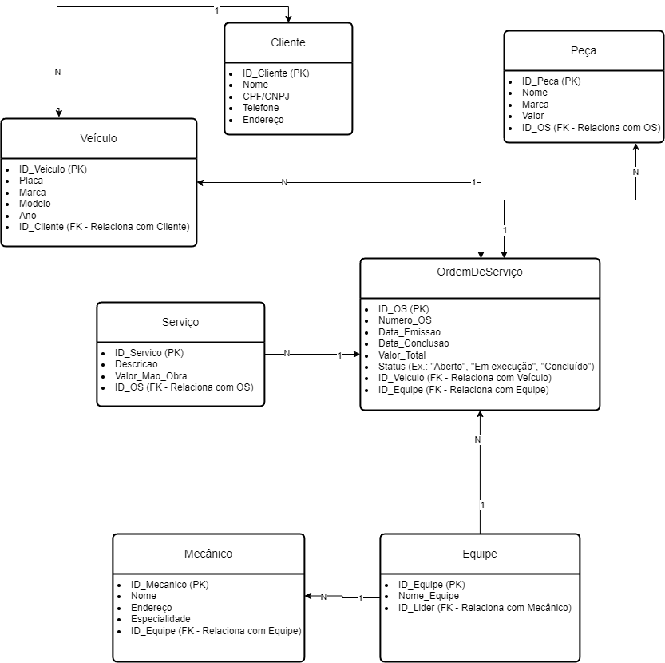

# Documentação do Projeto: Sistema de Gerenciamento de Oficina Mecânica

## Descrição do Projeto
O objetivo deste projeto é desenvolver um sistema para o controle e gerenciamento de execuções de ordens de serviço (OS) em uma oficina mecânica. O sistema visa atender desde o registro de clientes e veículos até o acompanhamento de serviços realizados e peças utilizadas, fornecendo uma visão completa e integrada das operações.

---

## Modelo Conceitual
O modelo conceitual foi elaborado para capturar todas as entidades, atributos e relacionamentos necessários para atender às necessidades do sistema, com base na narrativa fornecida.

### Entidades e Atributos

#### 1. **Cliente**
- **Atributos:**
  - ID_Cliente (PK)
  - Nome
  - CPF/CNPJ
  - Telefone
  - Endereço

#### 2. **Veículo**
- **Atributos:**
  - ID_Veiculo (PK)
  - Placa
  - Marca
  - Modelo
  - Ano
  - ID_Cliente (FK - Relaciona com Cliente)

#### 3. **Ordem de Serviço (OS)**
- **Atributos:**
  - ID_OS (PK)
  - Numero_OS
  - Data_Emissao
  - Data_Conclusao
  - Valor_Total
  - Status (ex.: Aberto, Em execução, Concluído)
  - ID_Veiculo (FK - Relaciona com Veículo)
  - ID_Equipe (FK - Relaciona com Equipe)

#### 4. **Equipe**
- **Atributos:**
  - ID_Equipe (PK)
  - Nome_Equipe
  - ID_Lider (FK - Relaciona com Mecânico)

#### 5. **Mecânico**
- **Atributos:**
  - ID_Mecanico (PK)
  - Nome
  - Endereço
  - Especialidade
  - ID_Equipe (FK - Relaciona com Equipe)

#### 6. **Serviço**
- **Atributos:**
  - ID_Servico (PK)
  - Descricao
  - Valor_Mao_Obra
  - ID_OS (FK - Relaciona com OS)

#### 7. **Peça**
- **Atributos:**
  - ID_Peca (PK)
  - Nome
  - Marca
  - Valor
  - ID_OS (FK - Relaciona com OS)

---

### Relacionamentos

1. **Cliente - Veículo:**
   - Um cliente pode ter muitos veículos, mas cada veículo pertence a apenas um cliente.
   - Relacionamento: 1:N (Cliente -> Veículo).

2. **Veículo - Ordem de Serviço (OS):**
   - Cada veículo pode ter muitas OS, mas uma OS pertence a apenas um veículo.
   - Relacionamento: 1:N (Veículo -> OS).

3. **Ordem de Serviço (OS) - Equipe:**
   - Cada OS é executada por uma equipe e cada equipe pode trabalhar em muitas OS.
   - Relacionamento: 1:N (Equipe -> OS).

4. **Equipe - Mecânicos:**
   - Cada equipe pode ter vários mecânicos, mas cada mecânico pertence a apenas uma equipe.
   - Relacionamento: 1:N (Equipe -> Mecânico).

5. **Ordem de Serviço (OS) - Serviço:**
   - Cada OS pode incluir vários serviços, mas cada serviço pertence a apenas uma OS.
   - Relacionamento: 1:N (OS -> Serviço).

6. **Ordem de Serviço (OS) - Peça:**
   - Cada OS pode incluir várias peças, mas cada peça pertence a apenas uma OS.
   - Relacionamento: 1:N (OS -> Peça).

---

## Diagrama Conceitual
O diagrama conceitual representa visualmente as entidades, seus atributos e os relacionamentos entre elas. Ele foi desenvolvido utilizando o padrão Entidade-Relacionamento (ER).

### Visualização do Diagrama Conceitual

---

## Próximos Passos
- Implementar o modelo lógico do banco de dados no PostgreSQL.
- Criar os scripts de criação de tabelas e inserção de dados.
- Validar a integridade e funcionalidade do sistema com exemplos práticos.

---

Caso tenha dúvidas sobre o modelo ou sugestões de melhorias, sinta-se à vontade para contribuir!
