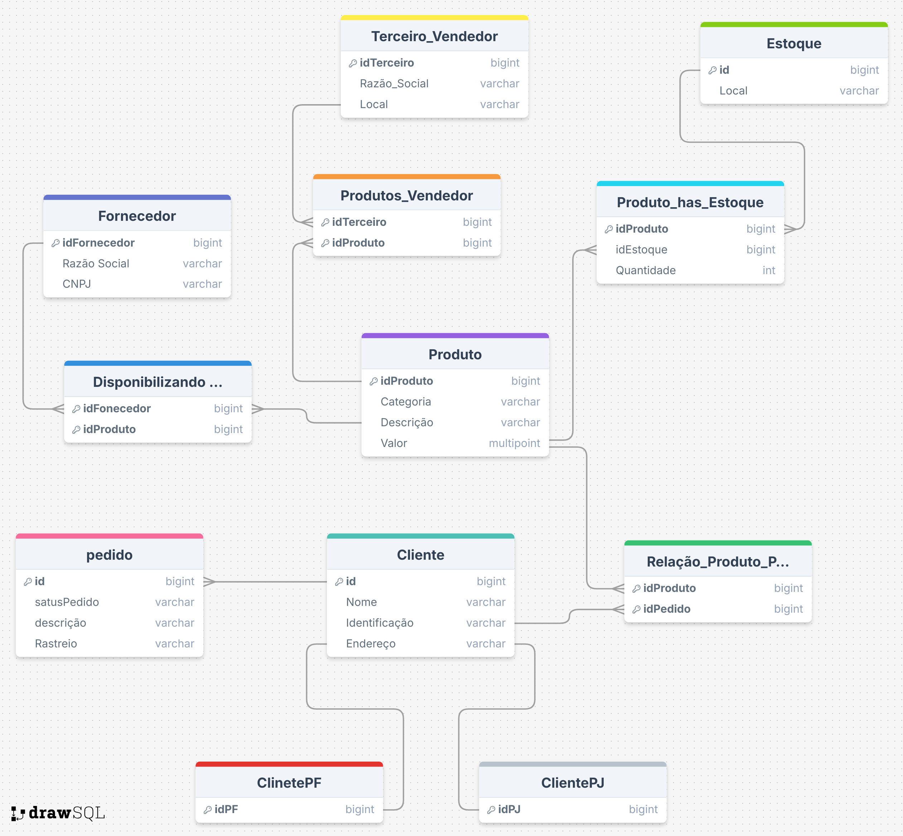

# 📄 Documentação do Diagrama EER

## Entidades e Atributos

1. **Produto** 🛒
   - `ID_Produto`: Identificador único do produto
   - `Nome_Produto`: Nome do produto
   - `Descrição`: Descrição detalhada do produto
   - `Preço`: Preço do produto
   - **Importância:** A entidade `Produto` é fundamental pois representa os itens comercializados pela empresa. Atributos detalhados ajudam a diferenciar e identificar cada produto de forma clara.

2. **Fornecedor** 🚚
   - `ID_Fornecedor`: Identificador único do fornecedor
   - `Nome_Fornecedor`: Nome do fornecedor
   - `Contato`: Informações de contato do fornecedor
   - `Endereço`: Endereço do fornecedor
   - **Importância:** Fornecedores são cruciais para manter o estoque e a disponibilidade de produtos. Ter contatos e informações detalhadas garante uma comunicação eficiente e gestão de parcerias.

3. **Cliente** 👥
   - Superclasse com as subclasses `PF` (Pessoa Física) e `PJ` (Pessoa Jurídica)
     - **PF (Pessoa Física)** 👤
       - `CPF`: Cadastro de Pessoa Física
       - `Nome`: Nome do cliente
       - `Data_Nascimento`: Data de nascimento do cliente
     - **PJ (Pessoa Jurídica)** 🏢
       - `CNPJ`: Cadastro Nacional da Pessoa Jurídica
       - `Razão_Social`: Razão social da empresa
       - `Nome_Fantasia`: Nome fantasia da empresa
   - Atributos comuns:
     - `ID_Cliente`: Identificador único do cliente
     - `Endereço`: Endereço do cliente
     - `Telefone`: Telefone de contato
   - **Importância:** Conhecer detalhadamente os clientes permite personalizar o atendimento e melhorar as estratégias de marketing e vendas, atendendo tanto pessoas físicas quanto jurídicas.

4. **Pedido** 📦
   - `ID_Pedido`: Identificador único do pedido
   - `Data_Pedido`: Data em que o pedido foi realizado
   - `Valor_Total`: Valor total do pedido
   - `ID_Cliente`: Relacionamento com a entidade Cliente
   - **Importância:** A gestão eficiente de pedidos é vital para garantir a satisfação do cliente e o fluxo de vendas. Cada pedido registrado permite o acompanhamento desde a solicitação até a entrega.

5. **Estoque** 🏬
   - `ID_Estoque`: Identificador único do estoque
   - `Localizacao`: Localização física do estoque
   - `Quantidade_Disponivel`: Quantidade de produtos disponíveis
   - **Importância:** O controle de estoque é essencial para evitar rupturas e excessos, garantindo que a oferta de produtos esteja sempre alinhada à demanda.

6. **Terceiro Vendedor** 🤝
   - `ID_Vendedor`: Identificador único do vendedor
   - `Nome_Vendedor`: Nome do vendedor
   - `Contato_Vendedor`: Informações de contato do vendedor
   - **Importância:** Terceiros vendedores ampliam o alcance de vendas e permitem a expansão dos negócios. Informações detalhadas facilitam a gestão e monitoramento dessas parcerias.

## Relações

1. **Produtos_Vendedor** (`Terceiro Vendedor` + `Produto`) 🔄
   - Representa os produtos vendidos pelo Terceiro Vendedor.
   - Atributos:
     - `ID_Vendedor`: Identificador do Terceiro Vendedor
     - `ID_Produto`: Identificador do Produto
   - **Importância:** Essa relação permite rastrear quais produtos são vendidos por terceiros, facilitando a gestão de vendas e comissões.

2. **Produtos_has_Estoque** (`Produto` + `Estoque`) 📊
   - Representa a quantidade de um produto específico em um estoque específico.
   - Atributos:
     - `ID_Produto`: Identificador do Produto
     - `ID_Estoque`: Identificador do Estoque
     - `Quantidade`: Quantidade do produto no estoque
   - **Importância:** Garante um controle preciso de onde os produtos estão armazenados e suas quantidades, essencial para uma gestão eficiente de inventário.

3. **Disponibilizado** (`Fornecedor` + `Produto`) 📝
   - Indica que um fornecedor disponibiliza um produto.
   - Atributos:
     - `ID_Fornecedor`: Identificador do Fornecedor
     - `ID_Produto`: Identificador do Produto
   - **Importância:** Esta relação facilita o rastreamento de quais produtos cada fornecedor oferece, permitindo uma gestão eficaz de suprimentos.

4. **Produto_Cliente** (`Produto` + `Cliente`) 🛍️
   - Representa a compra de produtos por clientes.
   - Atributos:
     - `ID_Produto`: Identificador do Produto
     - `ID_Cliente`: Identificador do Cliente
     - `Data_Compra`: Data da compra do produto pelo cliente
     - `Quantidade`: Quantidade comprada pelo cliente
   - **Importância:** Permite o acompanhamento das vendas e preferências dos clientes, fornecendo dados valiosos para estratégias de marketing e melhorias no atendimento.

# Diagrama

